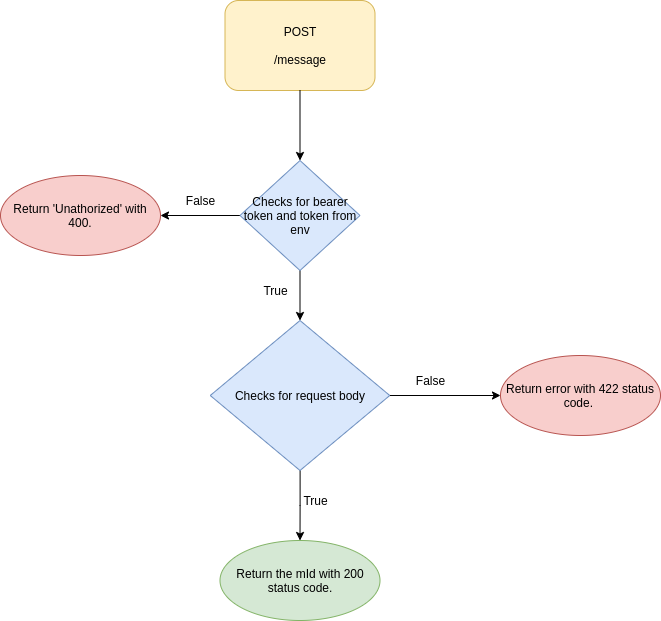

# Middle Server

This application is a middle server between the Custom Channel and 
third-party chat such as local SMS providers for better market penetration.

## List Of APIs

| No. | Method | API Endpoint | Description | Authorization | Request Body (Data Type)
|--- | ---- | ------ | ------------------ |  ---------- | ---------- |
| 1 | GET | / | Checks API health | none | none
| 2 | POST| /message | To retrieve message and return mId to Custom Channel and Third Party Chat | Bearer Token | message (Object), channelId (String), contactId (String)

## /message API Flow Diagram

 
 
 Figure 1 : API No. 2 
 

## Run Server Locally
    1. Copy the .env.sample and paste it to .env file.

    2. Run 'npm install' and then run 'docker-compose up'.

    3. Run 'ngrok http 3030' in a new terminal to expose server in public.
    Please refer https://ngrok.com/download to download.

    4. Copy the ngrok URL. (You can get it from http://localhost:4040/status)

    5. Paste it to the Custom Channel configuration and choose a type to create channel in platform.

    6. Copy the token, channelId after channel is created and paste it to CHANNEL_TOKEN, CHANNEL_ID variables in .env file.

    7. Run 'docker restart custom_channel' to restart server.

  ## Important Memo

  - Include the bearer token from the CHANNEL_TOKEN variable in the `Authorization` section or `Headers` section. Either way is fine.
  - Include the message, channelId and contactId in the `Request Body` section. 
  - The channelId in the `Request Body` section must be the same as CHANNEL_ID in .env file. Otherwise, error will be thrown.
  - The HTTP request method is POST.
  - Postman collection is avaiable in the docs folder to test out the webhook URL. Please fill up the environment variable before triggering.

## FAQ

#### Is it compulsory to use 3030 as my app port?

It is not compulsory to use `3030` as your app port. You may change it to other port such as `5000`, `8080` etc in Dockerfile, docker-compose.yml and .env file.

#### Can I run the server manually instead of using docker?
Yes, you may run the server manually from the terminal by downloading the whole repository.

#### Why I could not run the server by using docker command?
If you are using Linux, try to run `sudo docker compose-up` instead.

